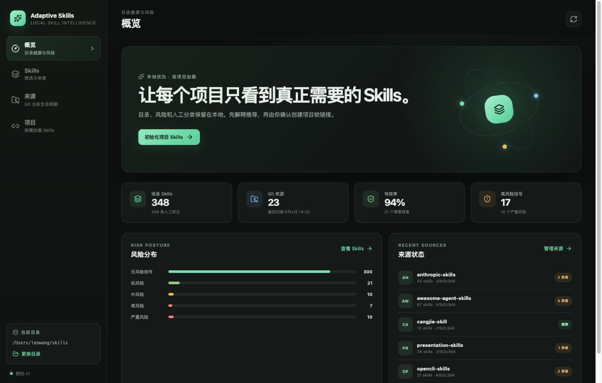
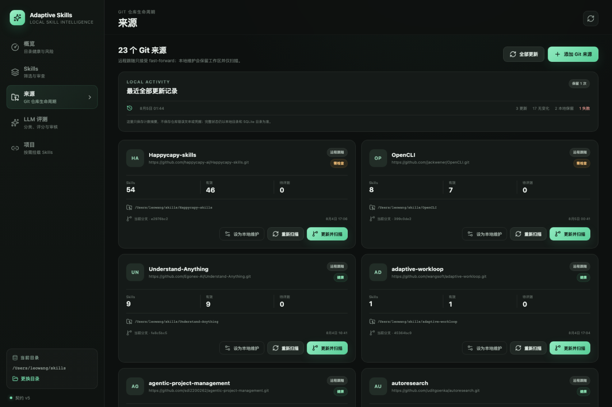

<p align="center">
  
</p>

<h1 align="center">Adaptive Skills</h1>

<p align="center">
  Local-first Skill management for coding agents.<br>
  面向 Coding Agent 的本地优先 Skill 管理器。
</p>

<p align="center"><a href="#中文">中文</a> · <a href="#english">English</a></p>

## 中文

### 技能管理理念

Skill 不应该全部塞进全局上下文。Adaptive Skills 把 `~/skills` 作为本地受管仓库：统一收集、扫描和评测 Skill，再按项目或 Agent 的实际需求建立软链接。来源始终可追踪，项目只加载需要的能力，已有文件默认不会被覆盖。

### 核心能力

- 管理多个 Git 来源，支持发现、Clone、批量更新、本地维护和安全移除。
- 扫描 `SKILL.md`、YAML frontmatter、格式兼容性及风险信号。
- 使用 SQLite 建立可检索目录，并通过 Codex CLI、Claude Code 或 OpenAI-compatible API 进行智能分类与评分。
- 按需求或固定分类推荐 Skill，解释匹配原因、质量与风险。
- 为普通项目和 Agent 全局目录创建受管理软链接；实体副本可备份后迁移为软链接。
- 记录来源更新、LLM 评测和项目变更历史。

### 界面

**目录概览** — 查看 Skill 数量、来源状态、有效率与风险分布。



**Git 来源** — 集中管理仓库生命周期、更新策略与批量拉取结果。



## English

### Skill management philosophy

Skills should not all live in global context. Adaptive Skills treats `~/skills` as a local managed library: collect, scan, and evaluate once, then symlink only the capabilities a project or agent actually needs. Provenance stays visible and existing files are preserved by default.

### Capabilities

- Discover, clone, update, preserve, and safely remove multiple Git sources.
- Parse `SKILL.md` and YAML frontmatter; separate compatibility issues from confirmed risks.
- Store the live catalog in SQLite and evaluate with Codex CLI, Claude Code, or an OpenAI-compatible API.
- Recommend by requirement or taxonomy with match, quality, and risk explanations.
- Manage project-scoped and agent-global symlinks, including backup-first migration of external copies.
- Keep source, evaluation, and project operation history.

## Run locally / 本地运行

Requires Python 3.12+, Node.js, Rust, and Git.

```bash
uv sync --extra desktop
cd app
npm ci
npm run tauri -- dev
```

Stack: Python · SQLite · PyYAML · React · TypeScript · Tauri. [Product](docs/PRODUCT.md) · [Design](docs/DESIGN.md) · [MIT License](LICENSE).
