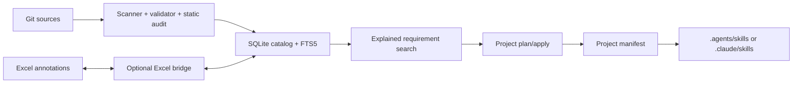

# Adaptive Skills

Adaptive Skills 是一个本地优先的 Agent Skills 管理器。它把分散在多个 Git 仓库中的
`SKILL.md` 扫描成可检索目录，并只把当前项目需要的 Skill 引用到项目内，避免把整套
Skill 库加载到全局环境。

当前版本包含可运行的 Python 核心和 macOS 优先的 Tauri 本地 App。核心能力使用 Python
标准库和系统凭据库实现；只有 Excel 导入导出需要可选的 `openpyxl` 依赖。App 通过版本化 JSON 契约
调用同一套核心，不直接查询 SQLite，也不在 TypeScript 或 Rust 中复制安全规则。

## 核心原则

- SQLite 是运行时事实来源，Excel 是人工标注和报表界面。
- Skill ID 由“来源 UUID + 仓库内相对路径”生成，不依赖名称、排序或 Excel 行号。
- 下载的仓库视为不可信输入：系统解析和静态审计文件，但绝不执行其中的脚本。
- 项目引用由 `.adaptive-skills/manifest.json` 管理；未登记的目录或文件永不覆盖。
- 默认写入 `.agents/skills`，也支持 Claude 的 `.claude/skills`。
- 优先创建软链接；不支持软链接的环境可自动回退为复制。

## 架构



模块职责：

- `sources.py`：克隆、登记、发现和快进更新 Git 来源。
- `scanner.py`：发现 `SKILL.md`，解析 frontmatter，校验 Agent Skills 约束，计算哈希并做静态安全审计。
- `database.py`：SQLite schema、FTS5 索引、来源/Skill/标注/扫描记录和项目索引。
- `catalog.py`：稳定 ID 查询、人工标注、中文与英文混合的可解释排序。
- `projects.py`：项目级 plan/apply/status/sync/unlink、项目索引和 manifest 安全边界。
- `evaluation.py`：Codex/Claude CLI 与 OpenAI-compatible API 的显式评测和提案审核。
- `inventory.py`：兼容现有工作簿的可选导入导出层。

## 安装

需要 Python 3.12+ 和 Git。推荐使用 `uv`：

```bash
uv venv
uv pip install -e .
```

需要 Excel 功能时：

```bash
uv pip install -e '.[excel]'
```

不安装包也可以在仓库中用 `PYTHONPATH=src python3 -m adaptive_skills ...` 运行。

## 从现有 Skill 库开始

以下流程不会修改已有仓库或原始 Excel；它只在 Skill 库内新增
`.adaptive-skills/catalog.db`。

```bash
adaptive-skills --library /Users/leowang/skills init
adaptive-skills --library /Users/leowang/skills source discover
adaptive-skills --library /Users/leowang/skills scan
adaptive-skills --library /Users/leowang/skills inventory import-xlsx \
  /Users/leowang/skills/skills-inventory.xlsx
```

`source discover` 只登记 Skill 库第一层中的 Git 仓库。也可以显式增加或登记来源：

```bash
adaptive-skills --library /Users/leowang/skills source add \
  https://github.com/example/skills.git --name example-skills --ref main

adaptive-skills --library /Users/leowang/skills source register \
  /Users/leowang/skills/existing-repository
```

来源更新只接受 fast-forward，并在工作区有未提交变化时拒绝操作：

```bash
adaptive-skills --library /Users/leowang/skills source update example-skills
adaptive-skills --library /Users/leowang/skills scan example-skills
```

一次更新并重新扫描全部来源：

```bash
adaptive-skills --library /Users/leowang/skills source refresh-all
```

批量命令会逐个执行安全更新；单个仓库失败不会中断其余仓库，结果会分别汇总已更新、
无变化和失败的来源。

对于需要长期保留本地模板或配置的仓库，可以切换为“本地维护”：

```bash
adaptive-skills --library /Users/leowang/skills source policy SOURCE_ID local
```

本地维护来源在“全部更新”时不会执行 `git pull`，而是保留当前工作区并重新扫描，结果单独
计入“本地保留”。切回远程跟随使用 `source policy SOURCE_ID remote`；切回后仍必须先处理
未提交内容，系统不会自动覆盖或合并。桌面 App 的每张来源卡片也提供相同的策略切换。

macOS 默认文件系统不区分文件名大小写。如果上游同时跟踪 `LICENSE.txt` 和
`license.txt`，Git 可能在没有人工修改时仍显示 dirty。这属于仓库与文件系统的兼容性
冲突，不应直接丢弃文件；可以在确认内容后对不需要展开的那个路径使用 Git 的
`skip-worktree`，或把仓库迁移到大小写敏感的卷。Adaptive Skills 仍保留 dirty 保护，
不会把这种兼容性冲突误当成可安全覆盖的普通修改。

## 检索和项目引用

先根据需求查看推荐及命中原因，不修改项目：

```bash
adaptive-skills --library /Users/leowang/skills project plan \
  /path/to/project \
  --requirement '根据技术方案制作结构清晰的中文演示文稿'
```

确认结果中的稳定 `id` 后应用：

```bash
adaptive-skills --library /Users/leowang/skills project apply \
  /path/to/project \
  --skill 00000000-0000-0000-0000-000000000000 \
  --requirement '根据技术方案制作结构清晰的中文演示文稿'
```

默认目标是 `.agents/skills`。使用 `--target claude` 可改为 `.claude/skills`；
使用 `--mode copy` 可强制复制。高风险或严重风险 Skill 默认不能检索或应用，只有在人工
检查后显式传入 `--allow-risk` 才能越过这道门。

检查、同步和移除项目引用：

```bash
adaptive-skills --library /Users/leowang/skills project status /path/to/project
adaptive-skills --library /Users/leowang/skills project sync /path/to/project
adaptive-skills --library /Users/leowang/skills project unlink /path/to/project --skill SKILL_ID
```

首次成功应用后，项目会自动进入当前 Skill 库的项目索引。索引只用于桌面入口和移动检测，
项目 manifest 仍是权威记录：

```bash
adaptive-skills --library /Users/leowang/skills project list
adaptive-skills --library /Users/leowang/skills project register /path/to/existing-project
adaptive-skills --library /Users/leowang/skills project relink PROJECT_ID /new/path
adaptive-skills --library /Users/leowang/skills project forget PROJECT_ID
```

`forget` 只删除本地索引行，不删除项目目录、软链接或 manifest。项目移动后会显示为 missing，
确认新目录中的 manifest 有效后才能 relink。

成功的应用、同步和移除操作会追加到项目自己的
`.adaptive-skills/manifest.json`，最多保留最近 100 条。查看记录：

```bash
adaptive-skills --library /Users/leowang/skills project history /path/to/project
```

桌面 App 的项目菜单先展示管理过的项目和状态，再进入单个项目查看同一份历史。项目目录、需求、目标 Agent 和风险开关，以及尚未提交
的 Git 来源添加表单，会按当前 Skill 库保存在本机 App 草稿中；切换菜单或重启 App 后可
恢复。项目页的“清空草稿”和来源表单的“取消并清空”可以显式删除这些本地草稿。

manifest 记录来源 URL、ref、commit、仓库内路径、内容哈希、安装方式和原始需求。建议提交
`.adaptive-skills/manifest.json`，并根据团队策略忽略项目中的实际软链接目录，因为软链接
目标通常包含本机绝对路径。

安全行为：

- 目标目录已有未受 manifest 管理的内容时，`apply` 失败。
- 复制内容被项目修改后，`sync` 和 `unlink` 默认失败；显式 `--force` 才会覆盖或移除。
- 软链接目标被替换后，默认不会删除替代内容。
- manifest 中出现绝对路径或 `..` 逃逸时，所有项目操作失败。
- 多 Skill 应用中途失败时，本次新建的条目会回滚。

## 本地桌面 App

桌面端位于 `app/`，采用 Tauri 2、React 和 TypeScript。当前可以：

- 查看真实目录概览、来源状态、有效性和风险分布；
- 按来源、分类和风险筛选 Skill，查看 `SKILL.md`、人工整理与静态审计；
- 根据项目需求生成推荐，显式选择后创建 manifest 管理的软链接；
- 检查项目链接状态、同步来源漂移和安全移除链接；
- 从历史项目列表进入详情、导入已有 manifest，并重新定位移动后的项目；
- 添加 Git 来源，以及一键对全部来源执行 fast-forward 更新和重新扫描。

开发运行前，先按上文安装 Python 项目，然后安装前端依赖：

```bash
cd app
npm install
npm run tauri -- dev
```

桌面桥默认使用仓库根目录的 `.venv/bin/python`。需要指定其他解释器时：

```bash
ADAPTIVE_SKILLS_PYTHON=/absolute/path/to/python npm run tauri -- dev
```

前端与 Rust 桥接验证：

```bash
cd app
npm run test -- --run
npm run build
cd ..
cargo test --manifest-path app/src-tauri/Cargo.toml
```

App 的 Rust 层以参数数组启动 Python，不经过 Shell。高风险或严重风险 Skill 默认不会进入
项目推荐；启用风险结果后，应用界面还会要求二次确认。所有实际文件变更仍由
`ProjectManager` 的目录边界、冲突检测和 manifest 规则控制。

## 可选 LLM 分类与质量评测

新 Clone 的来源会自动扫描并进入待评测队列，但不会在后台静默调用模型。桌面 App 的
“LLM 评测”页面支持多个连接配置：本机已经登录的 Codex CLI、Claude Code，以及
Responses API 或 Chat Completions 形态的 OpenAI-compatible 服务。配置文件只保存连接元数据；
API Key 写入操作系统凭据库，不进入 JSON、SQLite、命令参数或评测记录。只有用户点击
“开始评测”或“测试连接”后才会访问模型服务。

命令行配置和查看状态：

```bash
adaptive-skills --library /Users/leowang/skills llm config set \
  --provider codex --max-per-run 20
adaptive-skills --library /Users/leowang/skills llm status
adaptive-skills --library /Users/leowang/skills llm pending --source SOURCE_ID
```

增加一个 OpenAI-compatible 连接时，密钥只能通过桌面 App 的密码框，或一次性进程环境变量
传给 CLI；命令本身没有 `--api-key` 参数：

```bash
ADAPTIVE_SKILLS_LLM_PROFILE_SECRET='YOUR_KEY' \
adaptive-skills --library /Users/leowang/skills llm profile save \
  --id openai-main --name 'OpenAI main' \
  --provider openai-compatible --model MODEL \
  --base-url https://api.openai.com/v1 --api-mode responses

adaptive-skills --library /Users/leowang/skills llm profile list
adaptive-skills --library /Users/leowang/skills llm profile activate openai-main
```

远程 API 强制 HTTPS；只有 `localhost`、`127.0.0.1` 和 `::1` 可以使用 HTTP。网络响应有
大小和超时限制，重定向默认拒绝。OpenAI 官方端点的 `auto` 模式使用 Responses API，其他
兼容端点默认使用 Chat Completions；遇到兼容性差异时应显式选择模式。

显式评测一个来源，并审核产生的提案：

```bash
adaptive-skills --library /Users/leowang/skills llm evaluate --source SOURCE_ID
adaptive-skills --library /Users/leowang/skills llm list --status proposed
adaptive-skills --library /Users/leowang/skills llm apply EVALUATION_ID
```

LLM 在无工具、无会话持久化的结构化输出模式中运行。下载的 `SKILL.md` 始终作为不可信数据，
不会执行其中脚本或命令。评测先写入独立 proposal；Skill Arena 或人工标注已存在时，默认
拒绝覆盖，只有显式使用 `--replace-existing` 才能替换。

分类采用混合治理：15 个一级分类属于版本化公共主干；二级分类优先复用当前库中至少重复
出现的受控词表，无法归类时模型只能提出“新二级分类候选”；个性化用途通过自由标签表达。
质量评分由七个 0–10 维度按固定权重计算，最终仍为 0–10，而不是让模型直接给一个不可审计
的总分。每条结果记录 profile、provider、model、prompt、taxonomy 和 Skill 内容哈希，内容变化后旧
评测不会被误用。

项目推荐列表里的“匹配”是用于排序的需求相关度，可以高于 10；它不是 Skill
质量分。人工或 LLM 评测产生的“质量分”始终限定在 0–10，并在界面中显式标记
`/10`。

## Excel 工作流

导入匹配顺序是：`Skill ID` → 绝对/相对路径 → 唯一技能名。无法匹配或存在歧义的行会
在 JSON 结果中列出，不会按扫描序号猜测。当前工作簿中的这些列会映射到 annotations：

- `评分`、`评分来源`
- `一级分类`、`细分类`（也接受 `二级分类`）
- `解决的问题`、`应用场景`
- `备注 / 注意事项`（也接受 `备注`）
- `标签`

导出时可以复用原工作簿作为模板：

```bash
adaptive-skills --library /Users/leowang/skills inventory export \
  --template /Users/leowang/skills/skills-inventory.xlsx \
  --output /Users/leowang/skills/skills-inventory.updated.xlsx
```

系统保留模板中的其他 sheet，重建 `技能总表` 并新增或重建 `Sources`。来自不可信仓库且
以 `=`, `+`, `-`, `@` 开头的文本会被转义，避免成为 Excel 公式。MVP 不保证无损保留被
重建 sheet 的原有样式、图表、批注或宏，因此默认应导出到新文件再人工核对。

## 数据和信任边界

运行时状态位于 `<library>/.adaptive-skills/`：

- `catalog.db`：来源、Skill 元数据、annotations、扫描记录和 FTS5 索引。
- Skill 仓库仍保留在各自 Git 工作区；数据库可以随时重新扫描重建。
- 人工 annotations 通过稳定 ID 与 Skill 关联，重新扫描不会丢失。

静态审计目前检查远程脚本管道、危险的广域删除、敏感凭据路径、混淆执行、提示词覆盖
和全局 Git 配置等高信号模式。它是风险筛选器，不是完整的恶意代码证明；引入外部 Skill
前仍需要人工审查许可证、脚本和依赖。

## MVP 限制

- frontmatter 使用保守的无依赖解析器，支持常用标量、行折叠和行内列表，不是完整 YAML。
- 项目需求检索仍是确定性的词法排序加智能评分；可选 LLM 只负责 Skill 分类和质量评测，
  暂不参与项目需求匹配，也不包含向量数据库。
- 桌面 App 当前是开发构建；尚未把 Python 运行时封装为可移植 sidecar，也未签名或公证。
- 暂无 TUI、MCP 服务、自动更新调度和远程团队目录。
- 来源更新面向普通分支；复杂 tag/SHA pin 和依赖锁定留待后续版本。
- Windows 的软链接权限不足时使用 `--mode auto` 回退为复制，尚未在 Windows CI 验证。

## 开发和验证

核心测试不依赖第三方包：

```bash
PYTHONPATH=src python3 -m unittest discover -s tests -v
```

安装 Excel extra 后会额外运行工作簿迁移测试：

```bash
uv run --extra excel python -m unittest tests.test_inventory -v
```

测试使用临时 Git 仓库、临时 Skill 库和临时项目，覆盖稳定 ID、校验、风险拦截、中文检索、
软链接生命周期、复制漂移、目录冲突、manifest 路径逃逸和 Excel 公式注入防护。
