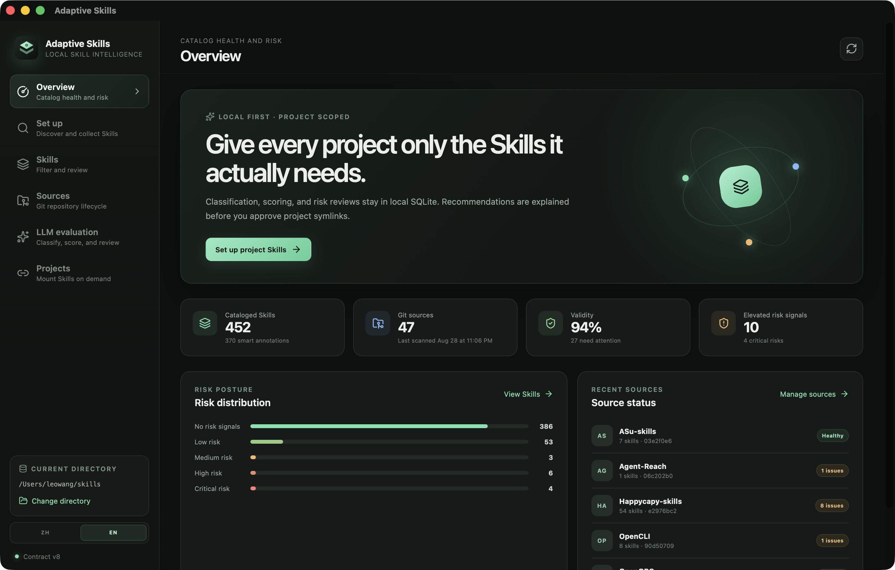
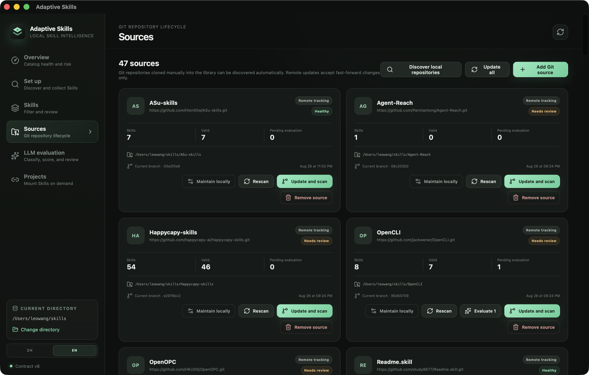

<p align="center">
  
</p>

<h1 align="center">Adaptive Skills</h1>

<p align="center"><a href="#中文">中文</a> · <a href="#english">English</a></p>

## 中文

### 管理理念

Skill 不应该全部塞进全局上下文。Adaptive Skills 将 `~/skills` 作为本地受管仓库：统一收集、扫描和评测 Skill，再按项目或 Agent 的实际需求建立软链接。来源始终可追踪，项目只加载需要的能力，已有文件默认不会被覆盖。

### 核心能力

- 管理多个 Git 来源，支持发现、克隆、批量更新、本地维护和安全移除。
- 扫描 `SKILL.md`、YAML frontmatter、格式兼容性和风险信号。
- 使用 SQLite 建立可检索目录，并通过 Codex CLI、Claude Code 或 OpenAI 兼容 API 进行智能分类与评分。
- 按需求或固定分类推荐 Skill，解释匹配原因、质量和风险。
- 为普通项目和 Agent 全局目录创建受管理软链接；实体副本可在备份后迁移为软链接。
- 记录来源更新、LLM 评测和项目变更历史。
- 界面支持简体中文与英文，可随时切换并记住选择。

### 界面

**目录概览** — 查看 Skill 数量、来源状态、有效率和风险分布。


**Git 来源** — 集中管理仓库生命周期、更新策略和批量拉取结果。


### 下载与安装

适用于 **macOS Apple Silicon（arm64）**：[下载 Adaptive Skills v0.1.15 DMG](https://github.com/wangsoft/Adaptive-Skills/releases/download/v0.1.15/Adaptive-Skills_0.1.15_aarch64.dmg)。当前构建使用临时签名，**未经过 Apple 公证**。请只从本仓库下载，并在解除隔离前核对 SHA-256。

```bash
cd ~/Downloads
shasum -a 256 Adaptive-Skills_0.1.15_aarch64.dmg
# 预期值：9381e39945df31cd289346c4b71ac9edcc63da7c326ffc28b23410843f42b64c
open Adaptive-Skills_0.1.15_aarch64.dmg
```

将 App 拖入 `/Applications`，解除隔离后启动：

```bash
xattr -dr com.apple.quarantine "/Applications/Adaptive Skills.app"
open "/Applications/Adaptive Skills.app"
```

### 本地开发

需要 Python 3.12+、Node.js、Rust 和 Git。

```bash
uv sync --extra desktop
cd app
npm ci
npm run tauri -- dev
```

技术栈：Python · SQLite · PyYAML · React · TypeScript · Tauri。 [产品说明](docs/PRODUCT.md) · [设计说明](docs/DESIGN.md) · [MIT 许可证](LICENSE)

## English

### Management philosophy

Skills should not all live in the global context. Adaptive Skills treats `~/skills` as a locally managed library: collect, scan, and evaluate each Skill once, then symlink only the capabilities a project or agent actually needs. Provenance remains visible, and existing files are preserved by default.

### Core capabilities

- Manage multiple Git sources with discovery, cloning, batch updates, local maintenance, and safe removal.
- Scan `SKILL.md`, YAML frontmatter, format compatibility, and risk signals.
- Build a searchable SQLite catalog and evaluate Skills through Codex CLI, Claude Code, or an OpenAI-compatible API.
- Recommend Skills by requirement or fixed taxonomy, with explanations for relevance, quality, and risk.
- Create managed symlinks for projects and agent-global directories; migrate physical copies after making a backup.
- Keep histories for source updates, LLM evaluations, and project changes.
- Switch between Simplified Chinese and English; the app remembers the selection.

### Interface

**Catalog overview** — Review Skill counts, source health, validity, and risk distribution.



**Git sources** — Manage repository lifecycles, update policies, and batch pull results.



### Download and install

For **macOS Apple Silicon (arm64)**: [download Adaptive Skills v0.1.15 DMG](https://github.com/wangsoft/Adaptive-Skills/releases/download/v0.1.15/Adaptive-Skills_0.1.15_aarch64.dmg). The current build uses an ad-hoc signature and is **not notarized by Apple**. Download it only from this repository and verify the SHA-256 checksum before removing quarantine.

```bash
cd ~/Downloads
shasum -a 256 Adaptive-Skills_0.1.15_aarch64.dmg
# Expected: 9381e39945df31cd289346c4b71ac9edcc63da7c326ffc28b23410843f42b64c
open Adaptive-Skills_0.1.15_aarch64.dmg
```

Drag the app into `/Applications`, remove quarantine, and launch it:

```bash
xattr -dr com.apple.quarantine "/Applications/Adaptive Skills.app"
open "/Applications/Adaptive Skills.app"
```

### Run locally

Requires Python 3.12+, Node.js, Rust, and Git.

```bash
uv sync --extra desktop
cd app
npm ci
npm run tauri -- dev
```

Stack: Python · SQLite · PyYAML · React · TypeScript · Tauri. [Product](docs/PRODUCT.md) · [Design](docs/DESIGN.md) · [MIT License](LICENSE)
